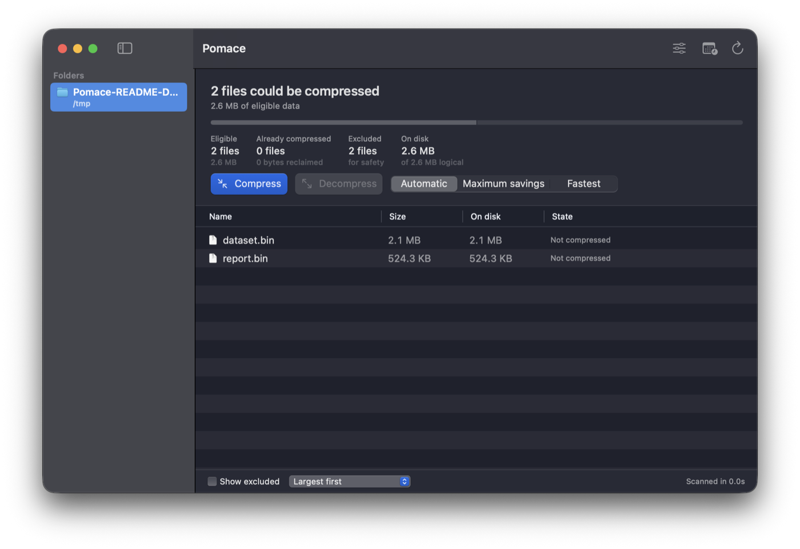
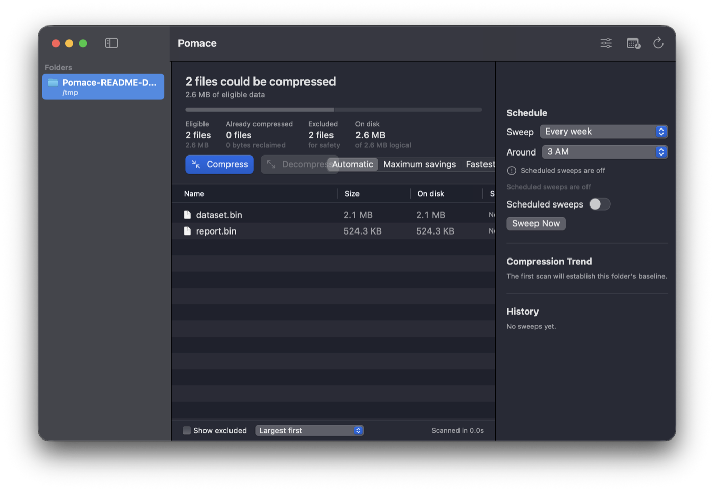

# Pomace

**Transparent filesystem compression for macOS, with a native UI and a memory.**

> *Pomace* is the dense solids left behind after apples are pressed.

Pomace is a native macOS app for inspecting, applying, and maintaining APFS/HFS+
transparent compression. It scans a folder before changing it, makes the current state
legible file by file, and can revisit watched folders to recover space that returns as
files are written over time.

Compressed files continue to open normally in Finder and every other app. There is no
archive to mount, extract, or manage: macOS transparently expands the data when it is
read.



## What Pomace Does

- **Scan first.** See eligible, already-compressed, and safety-excluded files before any
  mutation happens.
- **Compress and decompress.** Use guided modes for automatic behavior, maximum savings, or
  fastest processing. Every compression is verified, and decompression is a first-class,
  confirmed action.
- **Keep folders compressed.** Add a schedule and Pomace will re-sweep watched directories,
  recording the outcome and explaining when macOS conditions defer a run.
- **Explain its choices.** The advanced settings view exposes the compression plan and the
  reasoning behind it without making flags the default experience.



## A Note on "Transparent"

This is filesystem compression, not archival compression. Pomace never creates a private
file format and it never writes `decmpfs` attributes directly. It uses
[`applesauce`](https://github.com/Dr-Emann/applesauce) to ask macOS to apply transparent
compression to a file already on disk.

The important tradeoff is that writing to a compressed file may cause macOS to expand it
again. That is normal behavior, and it is why Pomace can watch a folder and rescan it on a
schedule.

## Safety

Pomace is deliberately cautious:

- A scan is read-only. Compression and decompression only begin from an explicit action.
- Compression is verified and the app re-scans through its native detector after a run.
- Unsafe or unhelpful content is excluded with a visible reason.
- Decompression names the affected file count and requires confirmation.
- The scheduled worker defers when system conditions make background I/O a bad citizen.

Read the [safety rules](docs/SAFETY.md) before using Pomace on data you cannot replace.

## Requirements

- macOS 14 Sonoma or later
- Apple silicon or Intel Mac
- APFS or HFS+ volume
- [`applesauce`](https://github.com/Dr-Emann/applesauce) for mutation; Pomace can offer a
  Homebrew installation when it is not already available

Pomace will still scan and explain a directory without changing it until the compressor is
available. Standard macOS privacy controls apply to locations such as Desktop, Documents,
Downloads, external volumes, and network shares.

## Install and Build

Pomace is currently an early preview. Notarized `.zip` downloads will be published on the
[GitHub Releases page](https://github.com/sdelavega/Pomace/releases). Unzip the release and
move `Pomace.app` to Applications.

To build from source:

```bash
swift test
./build-app.sh debug
open build/Pomace.app
```

The assembled application is signed when the configured local Developer ID identity is
available; otherwise the script makes an ad-hoc development build. Release packaging and
notarization are documented in [release/README.md](release/README.md).

## Project Status

Pomace has its scan engine, verified mutation flow, watched-folder sweeps, persisted
history, native UI, CI, and release tooling. The remaining release work includes a
notarized public build, updates, crash-reporting policy, and accessibility review. See the
[roadmap](docs/ROADMAP.md) for the honest checklist.

## Technical Notes

| Document | Contents |
| --- | --- |
| [Product requirements](docs/PRD.md) | Scope, users, constraints, and non-goals |
| [Architecture](docs/ARCHITECTURE.md) | Process model, scan engine, persistence, and scheduling |
| [Safety](docs/SAFETY.md) | Exclusions and operational invariants |
| [Decisions](docs/DECISIONS.md) | ADRs and their tradeoffs |
| [Defaults](docs/DEFAULTS.md) | Automatic compression policy |
| [M2 findings](docs/M2-FINDINGS.md) | The afsctool hard-link data-loss bug that prompted the move to applesauce |
| [Roadmap](docs/ROADMAP.md) | Milestones and remaining release work |

## License

Pomace is available under the [GNU General Public License, version 3 or later](LICENSE).
`applesauce` is also GPL-3.0 and remains separate software that Pomace invokes through a
process boundary.
